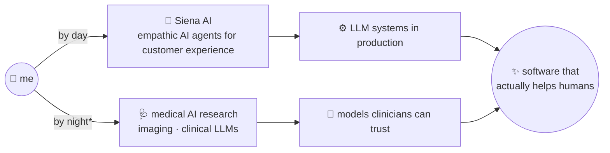

# Hi, I'm Iulia 👋

Software engineer at **[Siena AI](https://www.siena.cx)**, where I build empathic AI agents for customer experience. Off the clock, I research at the intersection of **medicine and machine learning** — from deep-learning pipelines for medical imaging to clinical tools people actually use.

Two different worlds, kept deliberately separate — one brain, two obsessions:

\* and weekends, and any suspiciously quiet afternoon

## 🗺️ The map

|  | 💼 Day job | 🔬 Research life |
|---|---|---|
| **Where** | [Siena AI](https://www.siena.cx) — autonomous CX for commerce | thesis work & my own repos |
| **What** | AI agents talking to real customers, at scale | deep learning for medical imaging · clinical LLM evaluation |
| **Code** | separate work account 🤫 | everything you see here |

## 🔬 Research & side quests

- 🫀 **LUCID** *(MSc thesis)* — automated carotid intima-media thickness (CIMT) measurement from ultrasound, using deep learning with uncertainty estimation
- ❤️ **[CardioInsight](https://github.com/IuliaMZbircea/CardioInsightApp)** *(BSc thesis)* — cardiology insights mobile app, React Native + Python
- 🧪 **[medevalkit](https://github.com/IuliaMZbircea/medevalkit)** — a two-agent evaluation harness for clinical LLMs — the one repo where my two worlds collide
- 📡 **[HeartSync](https://github.com/IuliaMZbircea/HeartSync)** — real-time patient monitoring platform with wearable integration
- 🦷 **[Dentix](https://github.com/IuliaMZbircea/Dentix)** — patient-record management for dental clinics

## 🧰 Tech

`Python` · `PyTorch` · `TypeScript` · `React / React Native` · `Node.js` · `Docker`

## 📬 Get in touch

[LinkedIn](https://www.linkedin.com/in/iulia-maria-zbircea/) — say hi 👋
